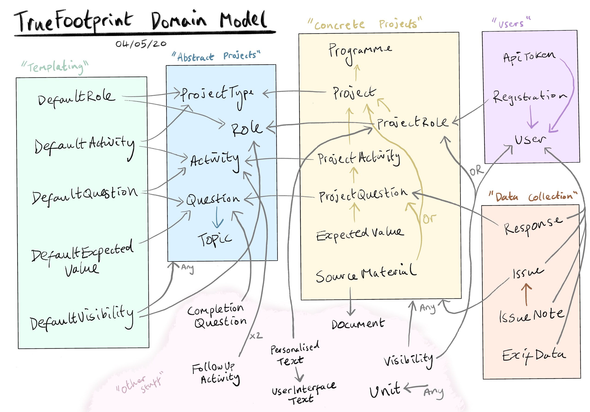

[< back to README](https://github.com/truefootprint/field-backend#readme)

The image above shows TrueFootprint's domain model. Each name corresponds to an
ActiveRecord model in this application and the arrows show `belongs_to`
relationships. For example,
[Project](https://github.com/truefootprint/field-backend/blob/master/app/models/project.rb)
belongs_to a Programme and ProjectType.

You can see that models are grouped into coloured boxes. Models in the same box
serve a similar purpose. The following sections explain these purposes. There
are some models at the bottom that don't really fit into a particular box.

### "Users"

This is perhaps the simplest box to understand. The system has users who access
it with an API token. Users can be registered on projects by associating them
with one of the roles for the project, e.g. 'monitor', 'farmer', etc.

API tokens are explained in more detail [here](./api_tokens.md).

### "Data collection"

The primary use-case of the FieldApp is that users answer questions and open
issues about projects they are involved with to try and fix them. This
generates data which is collected into some models, such as Response and Issues.

### "Concrete projects"

This box contains models that are project-specific and represent a real thing
happening somewhere in the world, such as 'Installing a water pump in Burundi'
or 'Building a school in Congo'. Each project has a various activities such as
'Digging the hole' or 'Laying the foundations' and we ask questions about those
activities.

Some of those questions have ExpectedValues, such as 5 meters for
'How deep is the hole?' and the expected values are usually specified in a
SourceMaterial, which might a contract for the project as a whole or a specific
page within that contract that relates to a specific question.

### "Abstract projects"

The difference between "Concrete projects" and "Abstract projects" is that the
latter contains descriptions of things, rather than real projects happening
somewhere in the world. For example, we might have a Question that says
'How deep is the hole?', but it isn't specific to a project, it's a question
without the context of what it refers to.

The same goes for activities. There could an activity like
'Laying the foundations' that applies to many different projects, e.g. school
construction, building roads, community centers, etc. The advantage of this
approach is we can re-use and aggregate data across projects that have the same
activities and questions.

Questions can be grouped into topics, which is really just a presentational
concern, but again could be useful in analysing groups of questions that ask
similar things, e.g. about 'Cement' or 'Usefulness'.

There are different 'types' of question, e.g. free-text, multi-choice. This is
explained in more detail [here](./question_types.md).

### "Templating"

Finally, the "Templating" box contains the machinery for creating new projects,
their activities, questions, etc. These models allow you to express that a
particular ProjectType, like 'School construction' has a default list of
activities like 'Laying the foundations', 'Build the walls',
'Install furnishings', etc.

Similarly, there might a default list of roles, such as 'Construction worker',
'Teacher', 'Student', etc. Each of the activities can then have a default list
of questions which may in turn have default expected values.

The "Templating" box really serves to allow projects that are similar in nature
to be replicated hundreds or thousands of times across the world. This codebase
contains a
[Template](https://github.com/truefootprint/field-backend/blob/master/app/services/template.rb)
service which uses these template models to generate projects and associate
them to the models in the "Abstract projects" box.

Of course, templates are only a guide and if a clients wants to ask an
additional question or remove one for a specific project, the system has the
flexibility to do that.

### "Other stuff"

- **CompletionQuestion**: a way to say that a particular question is the last
step in an activity. For example, the question might be "Are the foundations laid?"
and if the response is "Yes", then the next activity should begin.
- **FollowUpActivity**: a way to say that one activity is a "follow up" for
another. For example, if a user registers to attend a farming workshop, there
might be a follow-up activity for the trainer to visit their farm and see how
they're getting on.
- **UserInterfaceText**: all of the translatable text used in the FieldApp, this
is fetched from the API so that it can by changed dynamically without the user
having to re-install the app.
- **PersonalisedText**: a mechanism to override the UI text on a ProjectRole basis.
For example, we show different onboarding text to different users depending on
what role they play on the project.
- **Document**: a model that references a file on disk, like a project contract.
- **Visibility**: this is explained in much more detail [here](./visibility.md).
- **Unit**: a cross-cutting concern to represent 'meters, 'kilometers', etc.

[< back to README](https://github.com/truefootprint/field-backend#readme)
